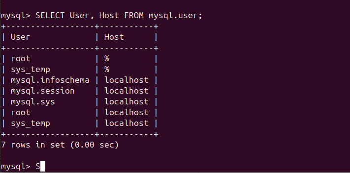
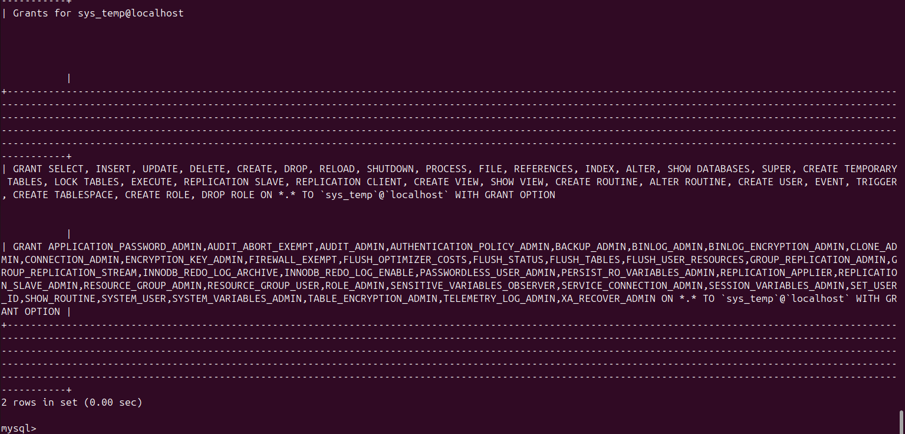
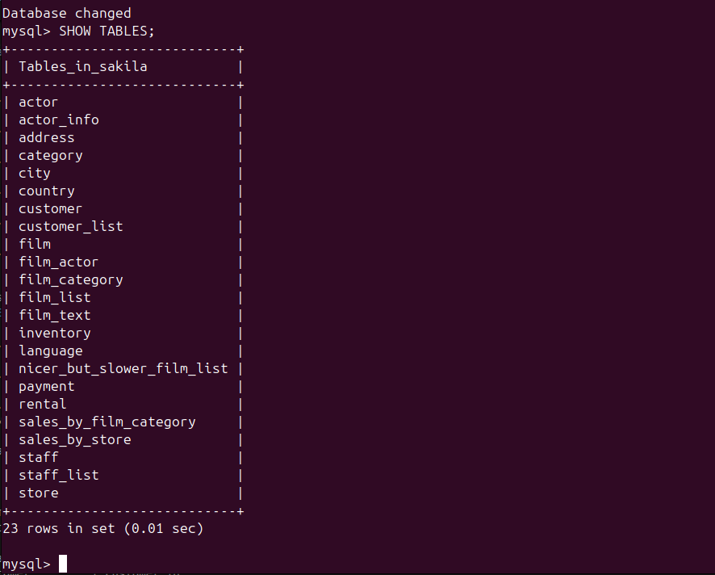
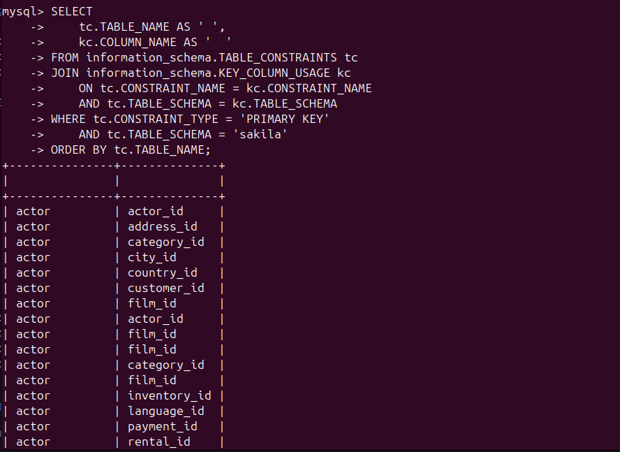

# Домашнее задание к занятию «Работа с данными (DDL/DML) Molov A.A.»

### Инструкция по выполнению домашнего задания

1. Сделайте fork [репозитория c шаблоном решения](https://github.com/netology-code/sys-pattern-homework) к себе в Github и переименуйте его по названию или номеру занятия, например, https://github.com/имя-вашего-репозитория/gitlab-hw или https://github.com/имя-вашего-репозитория/8-03-hw).
2. Выполните клонирование этого репозитория к себе на ПК с помощью команды `git clone`.
3. Выполните домашнее задание и заполните у себя локально этот файл README.md:
   - впишите вверху название занятия и ваши фамилию и имя;
   - в каждом задании добавьте решение в требуемом виде: текст/код/скриншоты/ссылка;
   - для корректного добавления скриншотов воспользуйтесь инструкцией [«Как вставить скриншот в шаблон с решением»](https://github.com/netology-code/sys-pattern-homework/blob/main/screen-instruction.md);
   - при оформлении используйте возможности языка разметки md. Коротко об этом можно посмотреть в [инструкции по MarkDown](https://github.com/netology-code/sys-pattern-homework/blob/main/md-instruction.md).
4. После завершения работы над домашним заданием сделайте коммит (`git commit -m "comment"`) и отправьте его на Github (`git push origin`).
5. Для проверки домашнего задания преподавателем в личном кабинете прикрепите и отправьте ссылку на решение в виде md-файла в вашем Github.
6. Любые вопросы задавайте в разделе «Вопросы по заданию» в личном кабинете.

Желаем успехов в выполнении домашнего задания.

---

Задание можно выполнить как в любом IDE, так и в командной строке.

### Задание 1
1.1. Поднимите чистый инстанс MySQL версии 8.0+. Можно использовать локальный сервер или контейнер Docker.

1.2. Создайте учётную запись sys_temp. 

1.3. Выполните запрос на получение списка пользователей в базе данных. (скриншот)

1.4. Дайте все права для пользователя sys_temp. 

1.5. Выполните запрос на получение списка прав для пользователя sys_temp. (скриншот)

1.6. Переподключитесь к базе данных от имени sys_temp.

Для смены типа аутентификации с sha2 используйте запрос: 
```sql
ALTER USER 'sys_test'@'localhost' IDENTIFIED WITH mysql_native_password BY 'password';
```
1.6. По ссылке https://downloads.mysql.com/docs/sakila-db.zip скачайте дамп базы данных.

1.7. Восстановите дамп в базу данных.

1.8. При работе в IDE сформируйте ER-диаграмму получившейся базы данных. При работе в командной строке используйте команду для получения всех таблиц базы данных. (скриншот)

*Результатом работы должны быть скриншоты обозначенных заданий, а также простыня со всеми запросами.*

Ответ:







```sql

CREATE USER 'sys_temp'@'localhost' IDENTIFIED BY 'password123';
CREATE USER 'sys_temp'@'%' IDENTIFIED BY 'password123';

SELECT User, Host FROM mysql.user;

GRANT ALL PRIVILEGES ON *.* TO 'sys_temp'@'localhost' WITH GRANT OPTION;
GRANT ALL PRIVILEGES ON *.* TO 'sys_temp'@'%' WITH GRANT OPTION;
FLUSH PRIVILEGES;

SHOW GRANTS FOR 'sys_temp'@'localhost';
SHOW GRANTS FOR 'sys_temp'@'%';

ALTER USER 'sys_temp'@'localhost' IDENTIFIED WITH mysql_native_password BY 'password123';
ALTER USER 'sys_temp'@'%' IDENTIFIED WITH mysql_native_password BY 'password123';
FLUSH PRIVILEGES;

-- Создание базы данных и восстановление дампа (выполняется в командной строке)
-- mysql -usys_temp -ppassword123 -e "CREATE DATABASE IF NOT EXISTS sakila;"
-- mysql -usys_temp -ppassword123 sakila < sakila-schema.sql
-- mysql -usys_temp -ppassword123 sakila < sakila-data.sql

USE sakila;
SHOW TABLES;

SELECT 
    TABLE_NAME, 
    TABLE_TYPE,
    ENGINE,
    TABLE_ROWS
FROM information_schema.TABLES 
WHERE TABLE_SCHEMA = 'sakila'
ORDER BY TABLE_NAME;

```

### Задание 2
Составьте таблицу, используя любой текстовый редактор или Excel, в которой должно быть два столбца: в первом должны быть названия таблиц восстановленной базы, во втором названия первичных ключей этих таблиц. Пример: (скриншот/текст)
```
Название таблицы | Название первичного ключа
customer         | customer_id
```

Ответ:



```sql

SELECT 
   tc.TABLE_NAME AS ' ',
   kc.COLUMN_NAME AS '  '
FROM information_schema.TABLE_CONSTRAINTS tc
JOIN information_schema.KEY_COLUMN_USAGE kc
   ON tc.CONSTRAINT_NAME = kc.CONSTRAINT_NAME
   AND tc.TABLE_SCHEMA = kc.TABLE_SCHEMA
WHERE tc.CONSTRAINT_TYPE = 'PRIMARY KEY'
   AND tc.TABLE_SCHEMA = 'sakila'
ORDER BY tc.TABLE_NAME;

```


## Дополнительные задания (со звёздочкой*)
Эти задания дополнительные, то есть не обязательные к выполнению, и никак не повлияют на получение вами зачёта по этому домашнему заданию. Вы можете их выполнить, если хотите глубже шире разобраться в материале.

### Задание 3*
3.1. Уберите у пользователя sys_temp права на внесение, изменение и удаление данных из базы sakila.

3.2. Выполните запрос на получение списка прав для пользователя sys_temp. (скриншот)

*Результатом работы должны быть скриншоты обозначенных заданий, а также простыня со всеми запросами.*
